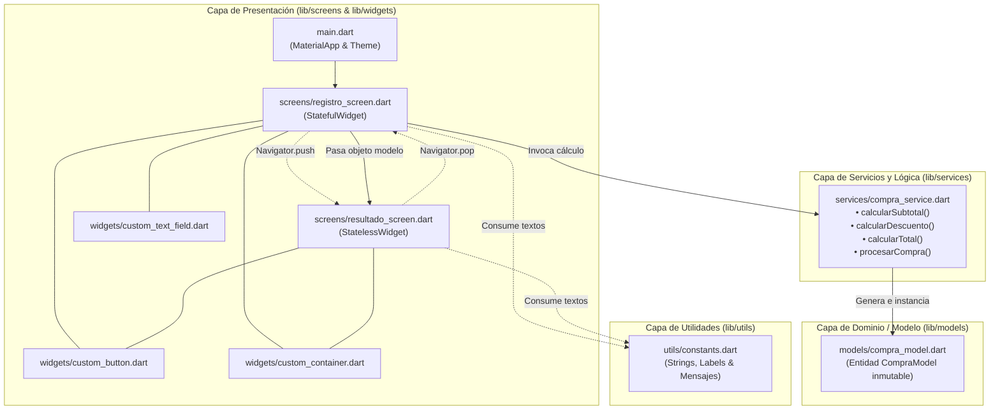
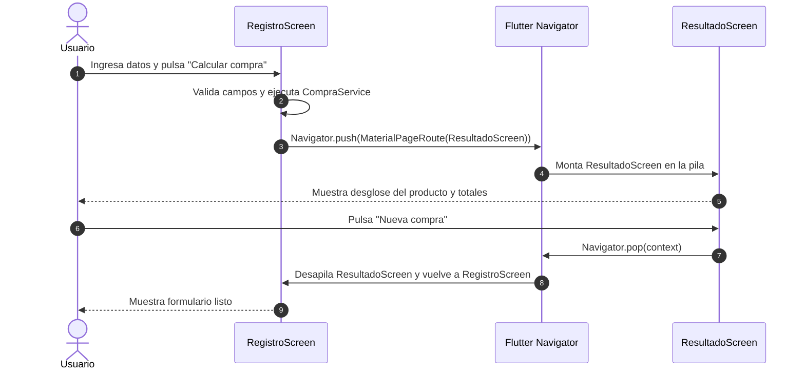

# Documentación Técnica - Calculadora de Compras

**Proyecto:** Calculadora de Compras en Flutter  
**Versión del Software:** 1.0.0+1  
**Versión del Documento:** 1.0.0  
**Fecha de Actualización:** 08/10/2026  
**Área:** Ingeniería de Software / Desarrollo Móvil  

---

## 1. Ficha Técnica y Especificaciones de Entorno

| Parámetro | Detalle / Versión |
| :--- | :--- |
| **Framework** | Flutter (versión soportada: 3.x o superior) |
| **Lenguaje de Programación** | Dart (SDK versión `>=3.0.0 <4.0.0`) |
| **Sistema de Diseño** | Material Design 3 (`useMaterial3: true`) |
| **Gestión de Estado** | Estado Efímero Local (`StatefulWidget` + `TextEditingController` + `setState`) |
| **Plataformas Soportadas** | Android, iOS, Web (Google Chrome), Windows, macOS, Linux |
| **Linter / Análisis Estático** | `flutter_lints: ^5.0.0` con `analysis_options.yaml` |
| **Framework de Pruebas** | `flutter_test` (Unit Tests & Widget Tests) |

---

## 2. Arquitectura de Software

El proyecto implementa una **Arquitectura Modular por Capas de Responsabilidad Única (*Separation of Concerns*)**, asegurando desacoplamiento entre la interfaz de usuario (UI), los modelos de datos y la lógica financiera del negocio.



### 2.1 Principios Arquitectónicos Aplicados
- **Single Responsibility Principle (SRP):** Cada clase tiene una sola razón de cambio: la vista solo se ocupa de la renderización y captura; el servicio se encarga de las fórmulas; el modelo representa la entidad de datos inmutable.
- **Componentes Reutilizables (*DRY - Don't Repeat Yourself*):** Los componentes visuales atómicos (`CustomTextField`, `CustomButton`, `CustomContainer`) centralizan estilos, padding, bordes y comportamiento visual para evitar duplicación.
- **Inmutabilidad de Datos:** La clase `CompraModel` expone únicamente atributos `final`, lo que garantiza que una vez procesado el cálculo, sus valores no puedan ser mutados accidentalmente en la vista.
- **Prevención de Fugas de Memoria (*Memory Leak Prevention*):** Los controladores de texto (`TextEditingController`) se liberan explícitamente en el ciclo de vida `dispose()` del estado.

---

## 3. Especificación Detallada de Archivos y Módulos

### 3.1 Punto de Entrada: `lib/main.dart`
- **Función `main()`:** Inicializa el árbol de widgets mediante `runApp(const MiAplicacionCompra())`.
- **Clase `MiAplicacionCompra` (`StatelessWidget`):**
  - Configura el widget raíz `MaterialApp`.
  - Establece el título de la aplicación (`'Calculadora de Compras'`).
  - Oculta la etiqueta de depuración (`debugShowCheckedModeBanner: false`).
  - Habilita Material 3 con paleta generada mediante semilla (`ColorScheme.fromSeed(seedColor: Colors.blue)`).
  - Define el color de fondo general de los Scaffolds (`0xFFF5F6F8`) para proveer un contraste limpio con las tarjetas blancas.
  - Asigna `RegistroScreen` como la ruta inicial (`home`).

---

### 3.2 Capa de Modelo: `lib/models/compra_model.dart`
Representa el objeto de transferencia de datos (*DTO*) inmutable que consolida tanto las entradas del usuario como los resultados de la liquidación.

```dart
class CompraModel {
  final String nombreProducto;
  final double precio;
  final int cantidad;
  final double porcentajeDescuento;
  final double subtotal;
  final double descuento;
  final double total;

  CompraModel({
    required this.nombreProducto,
    required this.precio,
    required this.cantidad,
    required this.porcentajeDescuento,
    required this.subtotal,
    required this.descuento,
    required this.total,
  });
}
```

- **Tipos de Datos Utilizados:**
  - `String`: Nombre del producto.
  - `double`: Magnitudes con posible componente decimal (precio, descuento, subtotal, total).
  - `int`: Cantidad de unidades físicas.

---

### 3.3 Capa de Servicio: `lib/services/compra_service.dart`
Contiene la lógica matemática pura del negocio, independiente del framework visual.

- **Método `calcularSubtotal(double precio, int cantidad) -> double`:**
  - Fórmula: `precio * cantidad`.
- **Método `calcularDescuento(double subtotal, double porcentajeDescuento) -> double`:**
  - Fórmula: `(subtotal * porcentajeDescuento) / 100`.
- **Método `calcularTotal(double subtotal, double valorDescuento) -> double`:**
  - Fórmula: `subtotal - valorDescuento`.
- **Método `procesarCompra(...) -> CompraModel`:**
  - Orquestador que ejecuta secuencialmente los tres métodos anteriores e instancia el modelo `CompraModel` con los valores consolidados.

---

### 3.4 Capa de Pantallas (*Screens*)

#### 3.4.1 `lib/screens/registro_screen.dart` (`StatefulWidget`)
- **Propósito:** Captura de datos, validación preventiva en cliente y envío de la transacción calculada.
- **Estado Local (`_RegistroScreenState`):**
  - Cuatro controladores de texto: `_cntNombre`, `_cntPrecio`, `_cntCantidad`, `_cntDescuento`.
  - Instancia de servicio: `_compraService`.
- **Manejo de Ciclo de Vida:**
  - Implementa `dispose()` sobrecargando el método para invocar `dispose()` en cada uno de los cuatro controladores, liberando los listeners nativos del motor de Flutter.
- **Flujo de Validación (`_calcularCompra`):**
  1. Extracción con `trim()` para limpiar espacios en blanco.
  2. Comprobación de campos vacíos mediante `isEmpty`.
  3. Conversión segura con `double.tryParse()` e `int.tryParse()`.
  4. Evaluación de restricciones de negocio: `precio <= 0`, `cantidad <= 0`, `descuento < 0`.
  5. Despliegue de advertencias vía `ScaffoldMessenger.of(context).showSnackBar()`.
  6. En caso de éxito, ejecución de `_compraService.procesarCompra(...)` y navegación con `Navigator.push`.
- **Función de Limpieza (`_limpiarCampos`):**
  - Invoca `clear()` en cada `TextEditingController`.

#### 3.4.2 `lib/screens/resultado_screen.dart` (`StatelessWidget`)
- **Propósito:** Presentación clara y desglosada del recibo/resumen de la compra.
- **Parámetros de Entrada:** Recibe obligatoriamente `final CompraModel compra` a través de su constructor.
- **Estructura Visual:**
  - `AppBar` con botón nativo de retroceso y título `tituloResultado`.
  - Tarjeta 1: Información del producto (Nombre, Precio Unitario formateado con `toStringAsFixed(2)`, Cantidad).
  - Tarjeta 2: Resumen financiero (Subtotal, Descuento con porcentaje entre paréntesis, Total resaltado en tamaño 18 y negrita).
  - Botón inferior: `CustomButton` con acción `Navigator.pop(context)` para volver a la pantalla anterior.

---

### 3.5 Capa de Widgets Personalizados Reutilizables (`lib/widgets/`)

#### 3.5.1 `custom_text_field.dart` (`StatelessWidget`)
- **Responsabilidad:** Encapsular un `TextField` con un diseño consistente y tipografía uniforme.
- **Propiedades configurables:**
  - `label` (`String`): Etiqueta flotante del campo.
  - `hint` (`String?`): Texto de sugerencia interior (*placeholder*).
  - `controller` (`TextEditingController`): Controlador de captura.
  - `keyboardType` (`TextInputType`): Tipo de teclado (`TextInputType.number`, `numberWithOptions(decimal: true)`, etc.).
  - `icon` (`IconData?`): Ícono de prefijo dentro del input.
- **Estilos:** `OutlineInputBorder` con radio de 8px, fondo grisáceo suave (`Colors.grey.shade50`) y relleno interno consistente.

#### 3.5.2 `custom_button.dart` (`StatelessWidget`)
- **Responsabilidad:** Botón de acción principal con ancho responsivo completo (`double.infinity`) y altura estandarizada (48px).
- **Propiedades configurables:**
  - `text` (`String`): Texto descriptivo en negrita.
  - `onPressed` (`VoidCallback`): Función disparadora de la acción.
  - `icon` (`IconData?`): Ícono opcional alineado junto al texto.
  - `color` (`Color?`): Color temático del botón con fallback al color primario del tema.

#### 3.5.3 `custom_container.dart` (`StatelessWidget`)
- **Responsabilidad:** Contenedor tipo tarjeta (*Card*) con borde sutil, esquinas redondeadas (12px) y sombra difusa (`BoxShadow`).
- **Propiedades configurables:**
  - `child` (`Widget`): Contenido embebido.
  - `padding`: Relleno interno (por defecto `EdgeInsets.all(16.0)`).
  - `margin`: Margen exterior (por defecto vertical de 8.0px).
  - `backgroundColor`: Color de fondo (por defecto blanco puro).

---

### 3.6 Capa de Utilidades: `lib/utils/constants.dart`
Centraliza cadenas estáticas para evitar cadenas "mágicas" dispersas en el código:
- Títulos de aplicación: `tituloApp`, `tituloResultado`.
- Etiquetas de formulario: `labelNombreProducto`, `hintNombreProducto`, `labelPrecio`, etc.
- Textos de botones: `btnCalcular`, `btnLimpiar`, `btnVolver`.
- Mensajes de validación: `msgCamposVacios`, `msgValoresInvalidos`.

---

## 4. Diagrama de Navegación y Pila de Rutas



---

## 5. Estrategia de Pruebas y Aseguramiento de Calidad

El proyecto dispone de una suite automatizada en `test/widget_test.dart` compuesta por:

### 5.1 Pruebas Unitarias de Lógica de Negocio
- **Objetivo:** Verificar la exactitud matemática de las funciones de `CompraService`.
- **Casos probados:**
  1. `calcularSubtotal(1000.0, 2)` $\rightarrow$ Esperado: `2000.0`.
  2. `calcularDescuento(2000.0, 10.0)` $\rightarrow$ Esperado: `200.0`.
  3. `calcularTotal(2000.0, 200.0)` $\rightarrow$ Esperado: `1800.0`.
  4. Método integrador `procesarCompra` con verificación de atributos del modelo generado.

### 5.2 Pruebas de Renderizado de Widgets (Widget Tests)
- **Objetivo:** Garantizar la renderización íntegra del árbol de widgets inicial.
- **Casos probados:**
  1. Montaje del widget `MiAplicacionCompra`.
  2. Presencia del título en AppBar (`find.text('Calculadora de Compras')`).
  3. Renderizado de los botones principales (`'Calcular compra'` y `'Limpiar campos'`).

---

## 6. Guía de Ejecución y Despliegue

### 6.1 Requisitos Previos
- Flutter SDK instalado y configurado en el `PATH` del sistema.
- Google Chrome instalado (para ejecución Web) o Android Studio / Emulador configurado (para ejecución móvil).

### 6.2 Comandos de Ejecución

#### Instalación y sincronización de dependencias
```powershell
flutter pub get
```

#### Ejecución en navegador Web (Google Chrome)
```powershell
flutter run -d chrome
```

#### Ejecución en dispositivo móvil conectado o emulador
```powershell
flutter run
```

#### Ejecución de la suite completa de pruebas automáticas
```powershell
flutter test
```

#### Análisis estático de calidad y verificación de linter
```powershell
flutter analyze
```

#### Generación de artefactos de distribución (Build)
- **Compilación Web lista para producción:**
  ```powershell
  flutter build web --release
  ```
- **Compilación APK para Android:**
  ```powershell
  flutter build apk --release
  ```
- **Compilación App Bundle para Google Play Store:**
  ```powershell
  flutter build appbundle --release
  ```
